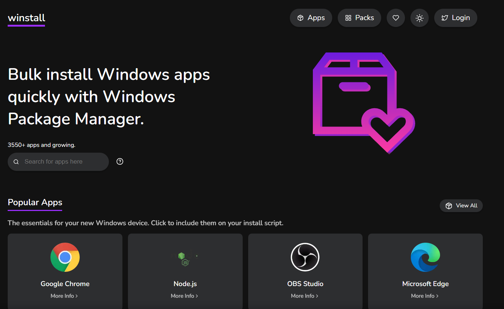
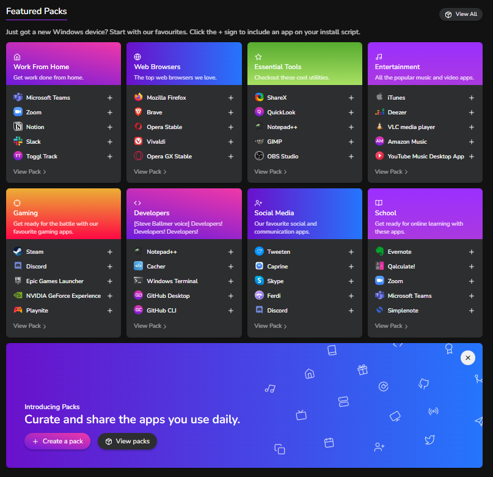
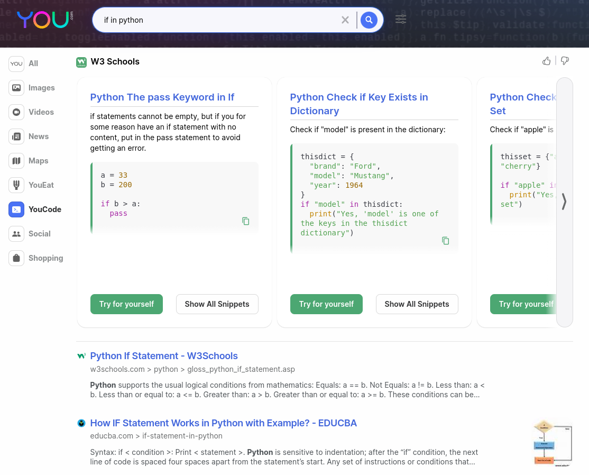

# Herramientas

Aqui te mostrare las herramientas que me he encontrado que pueden ayudarte o facilitarte algunas cosas o que te puede interesar en usar

## Descargar videos de youtube 

Aqui usaremos la herramientas [**youtube-dl**](https://github.com/ytdl-org/youtube-dl/blob/master/README.md#installation)

Una forma facil de instalar es con [python](https:www.python.org/) usando el instalador pip

Linux: `sudo -H pip install --upgrade youtube-dl`

Windows: `pip install --upgrade youtube-dl`

La sintaxis segun la documentacion oficial es la siguiente: `youtube-dl [OPTIONS] URL [URL]`

Pero la forma mas simple de usarlo es: `youtube-dl [URL]`

Despues de iniciara la descarga del video

debo recordarles que tambien tiene una version gui

[youtube-dl-gui](https://jely2002.github.io/youtube-dl-gui/)

## Instalar paquetes en windows facilmente

[winstall](winstall.app) es una pagina que nos permite generar un script para pawershell o CMD para poder instalar de forma facil nuestros programas.
en un solo ejecutable descargando y instalandolos de forma facil y sin mucho lio.

recomiendo ejecutarlo como administrador para que no te salga el aviso de instalacion o permiso de admin pero es muy util para instalar cosas en windows 
tiene un entorno facil de usar lo recomiendo para aquellos que cambian de equipo o nesesitan instalar rapidamente algunas herramientas en otros pc
como por ejemplo que todos los pc de tu empleza tendran algunos programas que si tiene esta pagina para una rapida instalacion sin tener que descargar todos por separado.

|winstall| Paquetes
|--|--|
||

## Buscador para programadores

encontre un buscador que se enfoca en ayudar a los programadores a encontrar informacion de forma mas enfocada tambien tiene para otras areas pero en este caso sera el de  code

[para ir ala pagina you](https://you.com/code)

buscador | ejemplo
--|--
 | 

